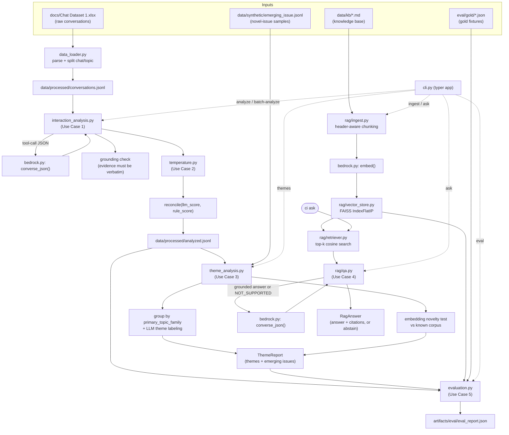

# Customer Intelligence

A small applied-AI solution covering four connected use cases over a real customer chat dataset:
structured interaction analysis, customer temperature scoring, theme/emerging-issue analysis, and
a grounded RAG Q&A capability - plus a practical evaluation harness.

See [assessment/AI_Engineer_Technical_Assessment.md](assessment/AI_Engineer_Technical_Assessment.md) for the original brief.

## Contents

- [Program flow](#program-flow)
- [Note on AWS Bedrock](#note-on-aws-bedrock)
- [Setup](#setup)
- [Running](#running)
- [Debugging in VS Code](#debugging-in-vs-code)
- [Project structure](#project-structure)
- [Architecture](#architecture)
- [Customer temperature](#customer-temperature)
- [Theme & emerging-issue analysis](#theme--emerging-issue-analysis)
- [RAG Q&A](#rag-qa)
- [Evaluation](#evaluation)
- [Configuration reference](#configuration-reference)
- [Known limitations](#known-limitations)

## Program flow

End-to-end data flow across all four use cases, from raw inputs through to the CLI/evaluation
outputs:



## Note on AWS Bedrock

The assessment prefers AWS Bedrock for generative AI components. Only OpenAI-compatible
credentials were available for this exercise, so `src/customer_intelligence/bedrock.py` wraps the
OpenAI SDK against a custom `base_url` instead of `boto3`/Bedrock. The module keeps the `bedrock`
name and a Bedrock-style `messages=[{"role": ..., "content": [{"text": ...}]}]` calling convention
so the rest of the codebase (ingestion, analysis, RAG) is not coupled to a specific provider - only
`bedrock.py` would need to change to target Bedrock's `converse` API instead.

## Setup

Requires Python 3.10+.

```powershell
python -m venv .venv
.\.venv\Scripts\Activate.ps1
pip install -e .
pip install -r requirements.txt
```

Copy [.env.example](.env.example) to `.env` and fill in your own credentials:

```
LLM_BASE_URL=...        # OpenAI-compatible base URL
LLM_API_KEY=...
LLM_MODEL=...
EMBEDDING_MODEL=...
EMBEDDING_DIMENSIONS=1024
```

## Running

All commands are exposed through the `ci` CLI (installed via `pip install -e .`).

```powershell
# Use Case 1: analyze a single conversation
ci analyze --index 0            # from the raw dataset (docs/Chat Dataset 1.xlsx)
ci analyze --text "My Wi-Fi keeps dropping!"
ci analyze --file path\to\conversation.txt --json

# Use Cases 1+3: batch-analyze the dataset, then find themes + emerging issues
ci batch-analyze                # writes data/processed/analyzed.jsonl
ci themes                       # also checks data/synthetic/emerging_issue.jsonl for novelty

# Use Case 4: RAG Q&A
ci ingest                       # builds artifacts/rag from data/kb/*.md
ci ask "What happens if my order arrives damaged?"

# Use Case 5: evaluation suite
ci eval                         # writes artifacts/eval/eval_report.json
```

Run `pytest -q` for the offline unit test suite (no network calls - the LLM/embedding client is
mocked via `tests/conftest.py`).

On Linux/macOS the same commands are available via `make install|ingest|batch-analyze|themes|eval|test`.

## Project structure

```
src/customer_intelligence/
  cli.py                  Typer app - analyze, batch-analyze, themes, ingest, ask, eval
  config.py                Settings (pydantic-settings, loads .env)
  logging_setup.py         Rich console + optional file logging
  taxonomy.py               Topic families/subtopics, sentiments, temperature bands
  schemas.py                Pydantic models shared across the app (see below)
  bedrock.py                OpenAI-compatible client (see "Note on AWS Bedrock")
  data_loader.py             Parses docs/Chat Dataset 1.xlsx -> Conversation records
  temperature.py             Rule-based scorer + LLM/rule reconciliation (Use Case 2)
  interaction_analysis.py    Structured analysis + grounding check (Use Case 1)
  theme_analysis.py          Theme grouping + emerging-issue detection (Use Case 3)
  evaluation.py              Gold-fixture evaluation harness (Use Case 5)
  prompts/                    Prompt templates (interaction_analysis, theme_label,
                              emerging_summery, rag_answer)
  rag/
    ingest.py                 KB chunking + embedding + index build
    vector_store.py           FAISS IndexFlatIP wrapper
    retriever.py               Top-k cosine retrieval
    qa.py                      Grounded answer generation + abstention (Use Case 4)
data/
  kb/                          Knowledge base markdown used by RAG
  processed/                   Cached conversations.jsonl / analyzed.jsonl (generated)
  synthetic/                   emerging_issue.jsonl (novelty test fixtures)
docs/                          Raw dataset (Chat Dataset 1.xlsx)
eval/gold/                     Gold fixtures for `ci eval`
artifacts/                     Generated FAISS index + eval_report.json (gitignored)
tests/                         Offline pytest suite (LLM/embeddings mocked)
.vscode/launch.json            Debug configurations (see above)
```

## Architecture

```
data/kb/*.md            -> ci ingest -> artifacts/rag (FAISS index + chunk metadata)
docs/Chat Dataset 1.xlsx -> data_loader -> data/processed/conversations.jsonl
                                         -> interaction_analysis (Use Case 1) -> analyzed.jsonl
                                         -> theme_analysis (Use Case 3)
question -> rag/retriever -> rag/qa (Use Case 4)
```

See [Program flow](#program-flow) above for the full diagram.

- **`data_loader.py`** parses the raw xlsx (columns: `ID`, `Input (Informal Chat & Topic)`,
  `Expected Output (Formal, Summarized Resolution Note)`), splitting the combined `Chat: "..."
Topic: ...` cell into the raw chat text and a topic label. The topic label and expected
  resolution note are kept only as reference/gold data for evaluation, never fed to the analysis
  prompt as ground truth.
- **`interaction_analysis.py`** (Use Case 1) forces a structured tool-call response from the LLM
  against the `InteractionAnalysis` schema, then runs a grounding check (every `evidence` quote
  must be a verbatim substring of the source conversation) and a temperature reliability
  cross-check (see below).
- **`temperature.py`** (Use Case 2) - see "Customer temperature" below.
- **`theme_analysis.py`** (Use Case 3) groups conversations by the already-grounded
  `primary_topic_family` from Use Case 1 (more reliable than re-clustering embeddings from
  scratch - see the design note in the module docstring), and separately runs an
  embedding-similarity novelty test against `data/synthetic/emerging_issue.jsonl` to demonstrate
  emerging-issue detection without being limited by the fixed taxonomy.
- **`rag/`** - `ingest.py` chunks knowledge base markdown (splitting on `##` headers first, then
  falling back to paragraph/sentence boundaries), embeds and stores chunks in a FAISS
  `IndexFlatIP` (`vector_store.py`); `retriever.py` does top-k cosine search; `qa.py` implements
  two-layer abstention (a retrieval-score gate, plus a model-level `NOT_SUPPORTED` sentinel) so the
  system declines to answer rather than fabricating information.
- **`evaluation.py`** (Use Case 5) - see "Evaluation" below.

## Customer temperature

`temperature_score` (0-100) and `temperature_band` (`calm` / `concerned` / `frustrated` / `angry` /
`critical`) represent escalation risk, not just negative sentiment - they factor in urgency,
repetition, and explicit churn/legal signals, which is why they're modeled as a separate scale from
`sentiment` rather than derived from it.

Reliability is handled by producing the score twice through independent means and reconciling
them:

1. The LLM assigns a score as part of the grounded structured analysis (from the full conversation).
2. `temperature.rule_based_score()` independently computes a score from sentiment + a fixed list of
   escalation keywords/punctuation signals - no LLM call, fully deterministic.
3. `temperature.reconcile()` compares the two: if they agree (within 20 points), the LLM's score is
   trusted; if they diverge, the final score is averaged and `agreement=False` is surfaced,
   flagging the case for human review rather than silently trusting either number. This
   agreement rate is also reported by `ci eval`.

## Theme & emerging-issue analysis

`ci themes` (Use Case 3) does two independent things over `data/processed/analyzed.jsonl`:

1. **Main themes** - conversations are grouped by the already-grounded `primary_topic_family`
   from Use Case 1, then the LLM labels each group (`label` + `description`) from a sample of its
   members. Grouping by a field the model already committed to during grounded analysis was a
   deliberate design choice over re-clustering embeddings from scratch: on this endpoint,
   within-family and across-family cosine similarities overlap heavily (within-family mean ~0.29,
   across-family mean ~0.21, max within-family ~0.62), so a fixed similarity threshold put almost
   every conversation in its own singleton cluster.
2. **Emerging issues** - `data/synthetic/emerging_issue.jsonl` (conversations about a topic
   outside the fixed taxonomy) is embedded and compared against the known corpus using a
   _relative_ novelty test: a conversation is flagged as emerging if its similarity to its own
   batch-peers exceeds its similarity to the known corpus by a margin (0.05), rather than an
   absolute similarity cutoff. An absolute threshold didn't cleanly separate the two populations
   on this endpoint (both scored 0.35-0.41); the relative test correctly grouped all synthetic
   conversations as one emerging cluster.

Output is a `ThemeReport` (themes + emerging issues), printed by the CLI and available as JSON via
`--json`.

## RAG Q&A

`ci ingest` (build) and `ci ask <question>` (query) implement Use Case 4:

- **Ingestion** (`rag/ingest.py`) chunks `data/kb/*.md`, splitting on `"\n## "` headers first (so
  a chunk never spans two FAQ subsections), then falling back to paragraph/sentence boundaries,
  with `chunk_size=400` / `chunk_overlap=60` (tuned down from an initial 800/no-header-split pass
  that merged subsections together and caused 2/8 gold questions to wrongly abstain). Chunks are
  embedded (`bedrock.embed()`) and stored in a FAISS `IndexFlatIP` over L2-normalized vectors
  (`rag/vector_store.py`), so inner product = cosine similarity.
- **Retrieval** (`rag/retriever.py`) embeds the question and returns the top `retrieval_top_k`
  chunks by cosine score, caching the loaded index across calls.
- **Answering** (`rag/qa.py`) forces a structured tool-call response and implements two-layer
  abstention: a retrieval-score gate (`retrieval_min_score`) and a model-level `NOT_SUPPORTED`
  sentinel the LLM must use when the retrieved chunks don't actually answer the question - so the
  system declines rather than fabricating an answer. Each answer carries `Citation`s (source file,
  title, chunk id, score, snippet).

## Evaluation

`ci eval` runs four checks against `eval/gold/*.json` and writes `artifacts/eval/eval_report.json`:

1. **Grounding + topic classification** - re-analyzes a gold sample of real conversations (whose
   topic label is taken directly from the dataset, not hand-written) and checks the LLM's
   `primary_topic_family` matches, and that no `evidence` quote is ungrounded.
2. **Consistency** - re-runs analysis twice on the same conversations and checks
   `temperature_band`/`escalation_required` agree between runs.
3. **Temperature reliability** - the LLM-vs-rule-based agreement rate described above.
4. **RAG correctness** - checks answers against gold Q&A pairs, including two deliberately
   out-of-scope questions that must be abstained rather than answered.

`tests/` contains fast, fully offline unit tests (the shared LLM/embedding client is mocked via
`tests/conftest.py`) covering schema validation, the rule-based temperature scorer, the data
loader, and the FAISS retriever.

## Configuration reference

All settings are loaded by `config.py` (`Settings`, pydantic-settings) from `.env` / environment
variables:

| Variable               | Default                    | Purpose                                               |
| ---------------------- | -------------------------- | ----------------------------------------------------- |
| `LLM_BASE_URL`         | _(required)_               | OpenAI-compatible base URL for chat + embeddings      |
| `LLM_API_KEY`          | _(required)_               | API key for the endpoint                              |
| `LLM_MODEL`            | _(required)_               | Chat/completion model name                            |
| `EMBEDDING_MODEL`      | _(required)_               | Embedding model name                                  |
| `EMBEDDING_DIMENSIONS` | `1024`                     | Embedding vector size (passed to the embeddings call) |
| `GEN_TEMPERATURE`      | `0.2`                      | Sampling temperature for generation calls             |
| `MAX_TOKENS`           | `1024`                     | Max output tokens per generation call                 |
| `RETRIEVAL_TOP_K`      | `4`                        | Chunks returned per RAG query                         |
| `RETRIEVAL_MIN_SCORE`  | `0.35`                     | Cosine-score floor before abstaining in RAG           |
| `CHUNK_SIZE`           | `400`                      | RAG chunk size (characters)                           |
| `CHUNK_OVERLAP`        | `60`                       | RAG chunk overlap (characters)                        |
| `ARTIFACTS_DIR`        | `artifacts`                | Output dir for the FAISS index + eval report          |
| `KB_DIR`               | `data/kb`                  | Knowledge base source markdown                        |
| `RAW_DATASET_PATH`     | `docs/Chat Dataset 1.xlsx` | Raw dataset location                                  |
| `PROCESSED_DIR`        | `data/processed`           | Cached conversations/analyzed JSONL                   |
| `SYNTHETIC_DIR`        | `data/synthetic`           | Emerging-issue novelty fixtures                       |

See [.env.example](.env.example) for a ready-to-copy template.

## Known limitations

- The knowledge base and `data/synthetic/emerging_issue.jsonl` are synthetic content authored for
  this exercise, not scraped from a live public source.
- Theme labels/descriptions and emerging-issue summaries are LLM-generated from a small sample of
  each cluster and are not independently fact-checked beyond the grounding rules in their prompts.
- `api.py` (an optional FastAPI mirror of the CLI) was left out of scope to prioritize the CLI,
  RAG, and evaluation harness within the assessment's expected effort.
